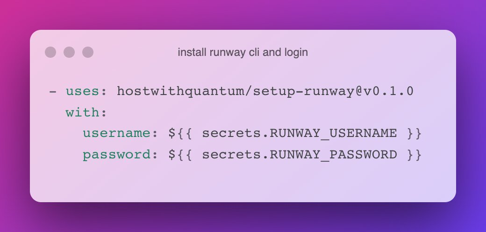

# hostwithquantum/setup-runway



A GitHub action to setup the runway CLI! Questions, issues? Please use discussions or the issue tracker on the repository. If you like what you see here, **we appreciate a** :star: and if you'd subscribe to [(our monthly) mailing list](https://runway.planetary-quantum.com/) to stay in the loop!

## Quick Start

```yaml
- uses: hostwithquantum/setup-runway@v0.2.1
  with:
    username: ${{ secrets.RUNWAY_USERNAME }}
    password: ${{ secrets.RUNWAY_PASSWORD }}
- run: runway whoami
```

## Options

Currently supported options:

| option        | default value       | description                                       |
|---------------|---------------------|---------------------------------------------------|
| username      | `<none>`            | username/email for runway                         |
| password      | `<none>`            | password for runway                               |
| add-key       | `false`             | if set to true, add the ssh key to runway         |
| setup-ssh     | `false`             | if set to true, setup ssh for `runway app deploy` |
| log-level     | `error`             | debug, info, warn, error                          |
| public-key    | `~/.ssh/id_rsa.pub` | ssh public key location                           |
| public-key    | `~/.ssh/id_rsa`     | ssh private key location                          |
| log-level     | `error`             | debug, info, warn, error                          |
| version       | `latest`            | `runway` cli version                              |

> For the version, `latest` is fine. We strive to never break your workflows. But sometimes BC breaks are necessary. Because they usually involve our client and APIs, using `latest` helps to keep all interruptions to a minimum.

## Examples

### Setup the runway CLI

This is an example how to setup the runway CLI and then how to deploy your app `cool-app`.

Once you have the client setup, you can run commands and play around with output and so on. To keep it simple, we're only deploying the code. :) Since the app exists already on runway we use the `runway gitremote` command to initialize the setup.

```yaml
# .github/workflows/release.yml
---
name: release

on:
  push:
    tags:

jobs:
  deploy:
    runs-on: ubuntu-latest
    env:
      YOUR_APPLICATION_NAME: cool-app
    steps:
      - uses: actions/checkout@v4
        with:
          fetch-depth: 0
      - name: create public/private key on GHA
        run: |
          mkdir -p ~/.ssh/
          echo ${{ secrets.PRIVATE_KEY }} > ~/.ssh/id_rsa
          echo ${{ secrets.PUBLIC_KEY }} > ~/.ssh/id_rsa.pub
          chmod 0600 ~/.ssh/id_rsa*
      - uses: hostwithquantum/setup-runway@v0.2.1
        with:
          username: ${{ secrets.RUNWAY_USERNAME }}
          password: ${{ secrets.RUNWAY_PASSWORD }}
          setup-ssh: true
      - run: runway -y gitremote -a ${YOUR_APPLICATION_NAME}
      - run: runway -y app deploy
```

### Running e2e tests

GitHub Actions provides a robust and comprehensive environment. In the following workflow we leverage some of its context in form of `${{ github.run_id }} to deploy your app with a unique name. Once deployed, you can run end-to-end tests against it and in the end, shut it down by deleting the app (and key). :)

```yaml
# .github/workflows/e2e.yml
---
name: e2e

on: 
  pull_request:

jobs:
  deploy_app:
    runs-on: ubuntu-latest
    timeout-minutes: 15
    steps:
      - uses: actions/checkout@v4
        with:
          fetch-depth: 0 # this is important!
      - name: create an ssh key just for this run
        run: |
          mkdir -p ~/.ssh/
          ssh-keygen -b 2048 -t rsa -f ~/.ssh/test-runner -c "test-key-${{ github.run_id }}" -q -N ""
      - name: install CLI, login and add ssh key
        uses: hostwithquantum/setup-runway@v0.2.1
        with:
          username: ${{ secrets.RUNWAY_USERNAME }}
          password: ${{ secrets.RUNWAY_PASSWORD }}
          public-key: ~/.ssh/test-runner.pub
          private-key: ~/.ssh/test-runner
          add-key: true
          setup-ssh: true
      - name: create app on runway (with a **unique name**)
        run: runway -y app create -a my-cool-app-${{ github.run_id }}
      - name: deploy your app to runway
        run: runway -y app deploy
      # this is where your tests run!
      - name: run your e2e tests here
        run: curl https://my-cool-app-${{ github.run_id }}.pqapp.dev/
      # then hopefully you are done :)
      - name: cleanup app
        if: always()
        run : runway -y app rm -a my-cool-app-${{ github.run_id }} || true
      - name: cleanup key - this is brute force
        if: always()
        run: runway -y key rm "test-key-${{ github.run_id }}" || true
```
